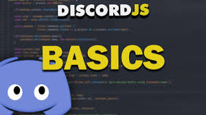

I was asked by my friends to create a discord bot for one of the channels I'm in. Creating the bot was pretty easy as there are templates online on how to create and customize them. There are a multitude of different bots that you can create. For example, the bot that I created was a music bot that would take polls for what song it would play next and then play the song with the most votes. You do have the option of coding the bot yourself and there are plenty of good tutorials that can teach you how to. Such as freecodecamp.com's youtube channel which gives a detailed explaination on how to code a discord bot in Python. I opted for the easier way and went through a template, customizing whatever I thought was necessary. 
