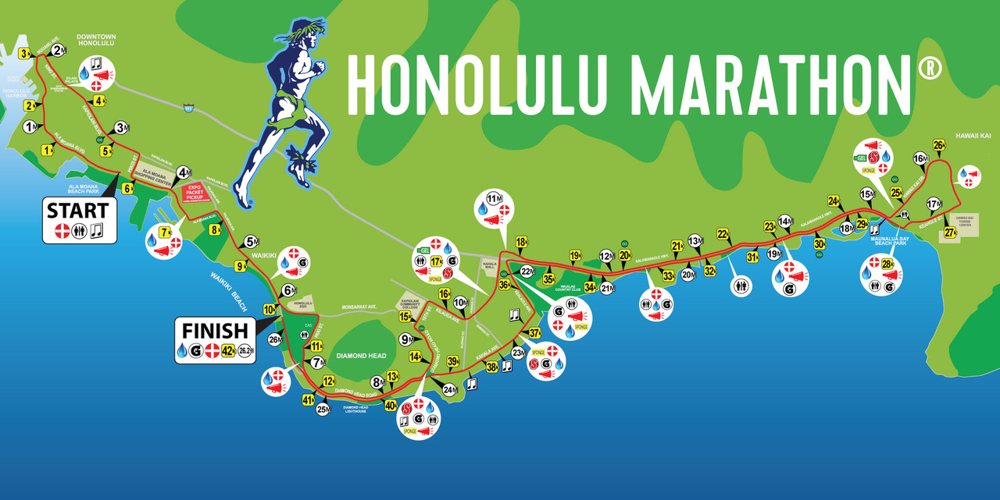

The Honolulu Marathon is a massive undertaking of 26.2 miles from Ala Moana Boulevard to Kapiolani Park. The marathon starts at 5:30 in the morning so getting there early to secure a good place is paramount. The course itself is mostly flat, but there are some big hills at the 8 mile mark and the 24th mile mark. These hills are about half a mile long and go up in elevation by about 100 feet. When running the marathon the early morning views are quite nice especially around the Diamond Head area. 

I made the decision to run the 2021 Honolulu Marathon in 2020 and began to start preparations as soon as I made the decision. I had to watch videos on how to prep, create a training guide, and work out any kinks in my plan. This was on top of starting college for the first time. There were a lot of ups and downs in my training and I actually got injured leading up to the marathon. But I had to perservere and keep on pushing. 

When the start date of the marathon finally came up, I was extremely nervous because my training had been a little rocky for a while. I went strong for about 20 miles but some complications came up and I collapsed. But I forced myself to get up and continue. The months and hours I poured into my preparations came together into a 4 hour marathon and a 3rd place finish in my age group, and despite all the obstacles that came up it was a good result in the end. 
